# Corix 🫀

**Heart Health Prediction API via Wearables & Lab Data**



**Corix** is an ML-based API service built with **FastAPI** that predicts heart health risks using both wearable device metrics and lab test results. It leverages advanced machine learning models and pipelines integrated with **MongoDB**, **DVC**, and **MLflow** for MLOps workflows, containerized and hosted on **AWS**.

## Features

* API Key Authentication with user registration and token quota
* Dual-Model Prediction:
  * RFC model for wearable data
  * LSTM model for lab results
* ML Model Management using DVC & MLflow on [Dagshub](https://dagshub.com/slalrijo2005/Corix)
* Dockerized for easy deployment
* Hosted on AWS
* Model retraining and version control

## ML Architecture

| Data Type     | Model Used                       | Purpose                        |
| -------------- | --------------------------------- | -------------------------------- |
| Wearable Data | RandomForestClassifier (Sklearn) | Feature-driven risk prediction |
| Lab Data      | LSTM (TensorFlow/Keras)          | Time-series based prediction   |

Model lifecycle is tracked using:

* **DVC** for dataset and model versioning
* **MLflow** for experiment tracking and deployment

## Tech Stack

* **Backend**: FastAPI
* **Database**: MongoDB
* **Cache**: Redis
* **ML Models**: Scikit-learn, LSTM (TensorFlow/Keras)
* **Tracking**: MLflow + DVC on Dagshub
* **Deployment**: Docker, AWS

## Project Structure

```
Corix/
├── assets/
│   └── file.svg                # README image asset
├── LICENSE
├── README.md
├── service/
│   ├── basic.py                # Basic service utilities
│   ├── docker-compose.yaml     # Multi-container orchestration
│   ├── Dockerfile              # Container setup
│   ├── model/                  # Model artifacts
│   ├── model_retriever.py      # Model fetch
│   ├── mongo.py                # DB connection
│   ├── redis_client.py         # Redis connection/caching
│   ├── requirements.txt
│   └── service.py              # FastAPI main application
└── training/
    ├── model_retraining.py     # Model training pipeline
    ├── requirements.txt
    ├── training_datasets/      # Sample data for retraining
    └── upload_model.py         # Upload models to MLflow with parameters and metrics
```

## Authentication

* **API Key system**: Each user receives a unique API key upon registration.
* **Daily token limit**: Usage restricted by a configurable daily request limit.

## Installation & Setup

### 1. Clone the repo

```bash
git clone https://github.com/RijoSLal/Corix.git
cd Corix
```

### 2. Run with Docker Compose (recommended)

```bash
cd service
docker compose up --build
```

this will start the API service along with its Redis dependency.

### 3. API will be live at

`http://localhost:8000/`

## Model & Data Versioning

Corix uses **DVC** and **MLflow**, tracked via **Dagshub**:

* Track experiments with MLflow
* Push/pull models via DVC

To pull the latest model/data versions:

```bash
dvc pull
```

## API Endpoints Overview

| Endpoint                  | Method | Description                                    |
| -------------------------- | ------ | ------------------------------------------------- |
| `/register`               | POST   | Register a new user                            |
| `/user_info`              | POST   | Retrieve user account information              |
| `/predict/from-lab`       | POST   | Predict health risk using lab parameters       |
| `/predict/from-wearables` | POST   | Predict health risk using wearable sensor data |

Full request/response schemas and interactive testing for all endpoints are available at the root `/` endpoint once the service is running.

## Contributing

Fork the repo, create a branch, commit your changes, push, and open a Pull Request.

## License

MIT License © [LICENSE](LICENSE)

<!-- # Corix 🫀

**Heart Health Prediction API via Wearables & Lab Data**


**Corix** is a ML-based API service built with **FastAPI** that predicts heart health risks using both wearable device metrics and lab test results. It leverages **Advance machine learning models and pipelines** integrated with **MongoDB**, **DVC**, **MLflow** for mlops workflows, containerized and hosted on **AWS**.


## 🚀 Features

* 🔐 **API Key Authentication** with user registration and token quota
* 🧠 **Dual-Model Prediction**:

  * RFC model for wearable data
  * LSTM model for lab results
* 📦 **ML Model Management** using DVC & MLflow on [Dagshub](https://dagshub.com/slalrijo2005/Corix)
* 🐳 Dockerized for easy deployment
* ☁️ Hosted on AWS
* 🔁 Model retraining and version control


## 🧠 ML Architecture

| Data Type     | Model Used                       | Purpose                        |
| ------------- | -------------------------------- | ------------------------------ |
| Wearable Data | RandomForestClassifier (Sklearn) | Feature-driven risk prediction |
| Lab Data      | LSTM (TensorFlow/Keras)          | Time-series based prediction   |

Model lifecycle is tracked using:

* **DVC** for dataset and model versioning
* **MLflow** for experiment tracking and deployment


## 🛠️ Tech Stack

* **Backend**: FastAPI
* **Database**: MongoDB
* **ML Models**: Scikit-learn, LSTM (TensorFlow/Keras)
* **Tracking**: MLflow + DVC on Dagshub
* **Deployment**: Docker, AWS


## 📁 Project Structure

```
Corix/                
├── example.log                 # Log examples
├── __pycache__/                # Compiled files
├── service/
│   ├── Dockerfile              # Container setup
│   ├── model_retriever.py      # Model fetch 
│   ├── mongo.py                # DB connection
│   ├── scaler_used_for_lab_model.pkl
│   ├── requirements.txt
│   └── service.py              # FastAPI main application
├── training/
│   ├── model_retraining.py     # Model training pipeline
│   ├── training_datasets/      # Sample data for retraining
│   ├── requirements.txt
│   └── upload_model.py         # Upload models to MLflow with parameters and metrices
```


## 🔐 Authentication

* **API Key system**: Each user receives a unique API key upon registration.
* **Daily token limit**: Usage restricted by a configurable daily request limit.


## 📦 Installation & Setup

### 1. Clone the repo

```bash
git clone https://github.com/RijoSLal/Corix.git
cd Corix
```

### 2. Build Docker container

```bash
cd service
docker build -t corix-service .
docker run -p 8000:8000 corix-service
```

### 3. API will be live at:

`http://localhost:8000/docs`


## 🔄 Model & Data Versioning

Corix uses **DVC** and **MLflow**, tracked via **Dagshub**:

* **Track experiments** with MLflow
* **Push/pull models** via DVC

To pull latest model/data versions:

```bash
dvc pull
```


---

## 📡 API Endpoints Overview

| Endpoint                  | Method | Description                                    |
| ------------------------- | ------ | ---------------------------------------------- |
| `/register`               | POST   | Register a new user                            |
| `/user_info`              | POST   | Retrieve user account information              |
| `/predict/from-lab`       | POST   | Predict health risk using lab parameters       |
| `/predict/from-wearables` | POST   | Predict health risk using wearable sensor data |


## 🧾 API Documentation Details

### 🔐 `/register`

**Description:** Register a new user
**Input:**

```json
{
  "username": "User's unique identifier",
  "email": "User's email address",
  "password": "User's password for authentication"
}
```

### 👤 `/user_info`

**Description:** Retrieve stored user information
**Input:**

```json
{
  "username": "User's unique identifier",
  "password": "User's password for authentication"
}
```


### 🧪 `/predict/from-lab`

**Description:** Predict health outcome using lab data
**Input:**

```json
{
  "ApiKey": "API key for authentication",
  "Age": 45,
  "Gender": 1,
  "Height": 170,
  "Weight": 70,
  "SystolicBP": 120,
  "DiastolicBP": 80,
  "Cholesterol": 2,
  "Glucose": 1,
  "Smoke": 0,
  "AlcoholIntake": 1,
  "PhysicalActivity": 1,
  "BMI": 24.2
}
```

---

### 📟 `/predict/from-wearables`

**Description:** Predict health outcome using wearable sensor data
**Input:**

```json
{
  "ApiKey": "API key for authentication",
  "PPG_1": 0.452,
  "PPG_2": 0.491,
  "PPG_3": 0.487,
  "ECG_1": 0.833,
  "ECG_2": 0.812,
  "ECG_3": 0.805,
  "SCG_1": 0.231,
  "SCG_2": 0.215,
  "SCG_3": 0.228,
  "BCG_1": 0.187,
  "BCG_2": 0.192,
  "BCG_3": 0.189
}
```

## 🧪 Example Usage (cURL)

### Register:

```bash
curl -X POST http://localhost:8000/register \
  -H "Content-Type: application/json" \
  -d '{"username": "john_doe", "email": "john@example.com", "password": "secure123"}'
```

### Predict from Lab:

```bash
curl -X POST http://localhost:8000/predict/from-lab \
  -H "Content-Type: application/json" \
  -d '{
    "ApiKey": "your-api-key",
    "Age": 50,
    "Gender": 1,
    "Height": 175,
    "Weight": 80,
    "SystolicBP": 130,
    "DiastolicBP": 85,
    "Cholesterol": 3,
    "Glucose": 2,
    "Smoke": 1,
    "AlcoholIntake": 0,
    "PhysicalActivity": 1,
    "BMI": 26.1
}'
```

## 🤝 Contributing

**Fork the repo → create a branch → commit your changes → push → open a Pull Request.**

## 📜 License

MIT License © [LICENSE](LICENSE)
 -->
